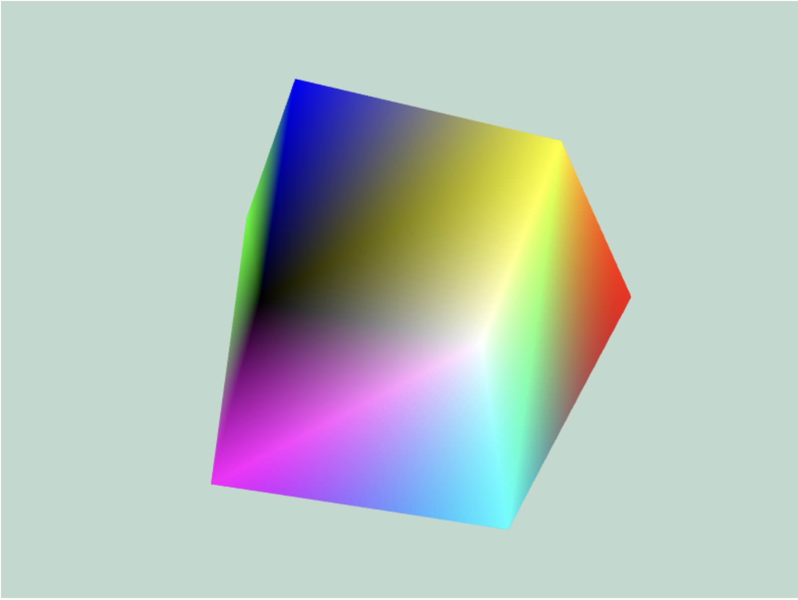

**Nama:** Pelangi Masita Wati  
**NRP:** 5025221051  
**Kelas:** Grafika Komputer A  
**Semester:** 5  
**Institut Teknologi Sepuluh Nopember**  
**Tahun:** 2024

# Tugas 1

# Tugas 2

# Tugas 3

## 1. Colorful Cube

https://github.com/user-attachments/assets/127b8bb6-47cd-4a86-b4d7-4e88e4c3f07b

Di dalam HTML, terdapat tag `<canvas>` yang berfungsi sebagai tempat rendering objek 3D, dan file JavaScript `script.js` dihubungkan untuk melakukan proses tersebut. Kode dimulai dengan mendapatkan elemen canvas menggunakan `getElementById`, kemudian menciptakan konteks WebGL (`gl`). Objek 3D dibuat dengan mendefinisikan buffer untuk menyimpan koordinat titik-titik (vertices) dari objek, seperti segitiga dan kubus. Data ini kemudian dikirim ke buffer WebGL menggunakan `gl.bufferData`.

Shader, yang bertugas untuk mengatur posisi dan warna objek, didefinisikan dengan dua program shader: vertex shader dan fragment shader. Vertex shader mengatur posisi setiap titik dari objek, sedangkan fragment shader menentukan warna objek tersebut. Setelah shader dikompilasi, shader tersebut dihubungkan ke program WebGL dan digunakan untuk menggambar objek.

Selain itu, terdapat kode untuk mempersiapkan warna tiap sisi kubus dan indeks untuk menggambar permukaan kubus menggunakan kombinasi dua segitiga per sisi. Kode juga mencakup pengaturan matriks proyeksi dan tampilan yang digunakan untuk memproyeksikan dan menampilkan objek 3D pada canvas. Fungsi-fungsi rotasi (`rotateX`, `rotateY`, `rotateZ`) digunakan untuk memutar objek 3D secara dinamis. Akhirnya, fungsi animasi digunakan untuk memperbarui posisi dan rotasi objek secara terus-menerus agar terlihat bergerak dan berputar pada canvas.

## 2. Cube Puzzle

https://github.com/user-attachments/assets/7c7d98d7-ebb2-4467-a656-36ae2d418fa7

Implementasi sederhana dari Rubik's Cube menggunakan p5.js, terinspirasi oleh Coding Challenge #142.1 dari The Coding Train oleh Daniel Shiffman. Kode ini menciptakan kubus Rubik 3x3x3, di mana setiap "cubie" (unit kecil dari kubus Rubik) di-render secara individual dalam 3D dengan menggunakan WebGL di p5.js.

Class `Cubie` bertanggung jawab untuk merepresentasikan setiap bagian kubus Rubik. Setiap cubie memiliki posisi (x, y, z) dan ukuran (`len_`). Fungsi `show()` menggambar cubie pada canvas, di mana setiap sisi cubie diberikan warna yang berbeda menggunakan metode `vertex()` untuk menggambar setiap sisi persegi. Karena versi p5.js yang digunakan tidak mendukung `beginShape(QUADS)` di mode WebGL, tiap sisi cubie digambar menggunakan empat titik (vertex) secara manual.

Dalam bagian utama kode, variabel `colors` mendefinisikan warna untuk setiap sisi kubus (atas, bawah, kanan, kiri, depan, dan belakang), dengan warna-warna standar Rubik's Cube seperti putih, kuning, oranye, merah, hijau, dan biru. Variabel `dim` mengatur dimensi kubus (3x3x3), dan array `cube` digunakan untuk menyimpan setiap cubie dalam tiga dimensi.

Fungsi `setup()` menginisialisasi canvas dengan WebGL, mengatur kamera menggunakan `createEasyCam()`, dan menciptakan setiap cubie di dalam kubus. Masing-masing cubie diposisikan secara relatif dalam grid 3x3x3.

Fungsi `draw()` bertanggung jawab untuk me-render setiap cubie pada layar. Di dalam fungsi ini, looping tiga tingkat digunakan untuk mengiterasi melalui setiap cubie dalam grid dan menampilkan mereka menggunakan metode `show()` dari class `Cubie`.

Dengan menggunakan `p5.EasyCam`, pengguna dapat memanipulasi tampilan kamera untuk melihat kubus dari berbagai sudut dengan interaksi mouse.

## 3. Shadow Cube

https://github.com/user-attachments/assets/5c86d72b-aebf-4124-a690-caf7fb2d32c4

Membuat kubus 3D yang berputar menggunakan WebGL dan memanfaatkan shader vertex dan fragment untuk merendernya. Tujuan utamanya adalah menggambar dan memutar kubus 3D secara terus-menerus di kanvas WebGL. WebGL digunakan untuk berinteraksi langsung dengan GPU, memastikan rendering grafis yang halus dan memungkinkan akselerasi perangkat keras.

Pada bagian JavaScript, beberapa fungsi utama didefinisikan. Fungsi initGL() menginisialisasi konteks WebGL dari elemen <canvas> di HTML. Fungsi ini mengatur viewport dan mengaktifkan depth testing, yang memastikan bahwa objek yang lebih dekat akan menutupi objek yang lebih jauh. Selanjutnya, fungsi createShaders() mengambil shader vertex dan fragment dari HTML, mengaitkannya ke dalam program WebGL, dan menyusun shader tersebut. Shader ini adalah program kecil yang berjalan di GPU dan menangani bagaimana posisi vertex diatur serta bagaimana warna diaplikasikan pada piksel kubus.

Fungsi createVertices() mendefinisikan posisi vertex untuk kubus, dengan menetapkan 8 titik dalam ruang 3D (x, y, z) yang membentuk sudut-sudut kubus. Vertex ini kemudian disimpan dalam buffer WebGL. Selain vertex, fungsi ini juga membuat buffer untuk normal, yaitu vektor yang digunakan untuk menghitung bagaimana cahaya berinteraksi dengan permukaan kubus. Normal ini berperan penting dalam efek pencahayaan karena memungkinkan shader fragment mensimulasikan pencahayaan yang realistis dengan menghitung seberapa banyak cahaya yang mengenai setiap permukaan.

Fungsi createIndices() mendefinisikan hubungan antara vertex menggunakan indeks. Indeks ini memetakan segitiga-segitiga yang membentuk enam sisi kubus. Kubus ini terdiri dari 12 segitiga, dan setiap segitiga didefinisikan oleh tiga indeks yang menunjuk ke vertex. Indeks ini kemudian disimpan dalam buffer, memungkinkan WebGL untuk secara efisien mereferensikan vertex saat menggambar segitiga-segitiga tersebut.

Fungsi draw() menangani proses rendering kubus. Pada setiap frame, kubus diputar sedikit di sepanjang sumbu X, Y, dan Z, memberikan efek rotasi yang terus menerus. Matriks transformasi yang digunakan untuk rotasi ini diperbarui sebelum setiap frame digambar. WebGL membersihkan kanvas dan menggambar ulang kubus menggunakan matriks transformasi yang diperbarui, yang menghasilkan objek 3D yang berputar dengan lancar. Loop rendering ini dijaga menggunakan fungsi requestAnimationFrame() untuk memastikan animasi yang halus.

Dua shader disematkan di dalam HTML. Shader vertex, yang didefinisikan dalam blok <script> dengan tipe x-shader/x-vertex, menghitung posisi setiap vertex dalam tampilan dengan menerapkan matriks perspektif dan transformasi. Shader ini juga menangani pencahayaan dengan menghitung bagaimana cahaya berinteraksi dengan permukaan kubus berdasarkan normal. Shader fragment, yang ditemukan dalam blok <script> dengan tipe x-shader/x-fragment, menerapkan warna pada setiap piksel berdasarkan perhitungan pencahayaan yang dilakukan oleh shader vertex.

Di HTML, elemen <canvas> berfungsi sebagai area tempat WebGL merender kubus 3D. Shader-shader tersebut disertakan dalam tag <script> dan diakses berdasarkan ID-nya dari dalam JavaScript. Kombinasi shader dan JavaScript ini menciptakan kubus yang berputar secara dinamis dengan efek pencahayaan dasar, memberikan demonstrasi sederhana namun efektif dari kemampuan WebGL.

## 4. Solar System

https://github.com/user-attachments/assets/bc0ef983-b67d-4a42-b730-00e33b1983df

Membuat simulasi tata surya 3D menggunakan p5.js, di mana matahari dikelilingi oleh planet dan bulan yang dapat berputar. Proyek ini mengimplementasikan fungsi orbit untuk memutar planet-planet dan menampilkan bentuk bola sebagai representasi matahari dan planet di ruang 3D.

Bagian utama dari simulasi ini menggunakan kelas `Planet`, yang memiliki beberapa properti seperti radius, jarak dari pusat, kecepatan orbit, dan vektor acak untuk menentukan posisinya dalam ruang. Setiap planet dapat memiliki "bulan" atau sub-planet yang juga berputar. Fungsi `spawnMoons` digunakan untuk membuat bulan dengan jumlah acak yang mengorbit di sekitar planet utama.

Pada fungsi `setup`, kanvas 3D dibuat menggunakan `createCanvas` dengan fitur WebGL. Kamera dikelola menggunakan pustaka `p5.EasyCam`, memungkinkan pengguna untuk mengubah sudut pandang dengan mudah. Matahari, sebagai pusat tata surya, diinisialisasi sebagai objek `Planet` dan diberi beberapa bulan menggunakan metode `spawnMoons`.

Dalam fungsi `draw`, latar belakang hitam diatur, lampu dinyalakan, dan planet serta bulan ditampilkan dengan fungsi `show`. Setiap objek terus-menerus diorbit menggunakan metode `orbit`, yang memperbarui sudut planet secara bertahap untuk membuat ilusi pergerakan di sekitar matahari.

Proyek ini menggunakan teknik pemodelan objek sederhana dan transformasi 3D untuk menghasilkan simulasi interaktif yang menarik dari tata surya.

## 5. Sphere

https://github.com/user-attachments/assets/3c7df87b-acaa-41d0-a250-81c241f45e4d

Membuat visualisasi 3D bola dunia menggunakan geometri bola dengan p5.js. Dalam simulasi ini, bola dunia digambar menggunakan strip segitiga yang terbentuk dari koordinat titik-titik di permukaan bola.

Proyek ini dimulai dengan mendeklarasikan variabel-variabel untuk menyimpan titik-titik globe, jari-jari bola `r`, dan jumlah total titik dalam grid (variabel `total`). Dua variabel tambahan, `angleX` dan `angleY`, digunakan untuk memutar bola secara bertahap.

Pada fungsi `setup`, kanvas WebGL berukuran 500x500 dibuat. Array `globe` diisi dengan titik-titik yang dihitung menggunakan trigonometri. Koordinat setiap titik di permukaan bola dihitung berdasarkan lintang dan bujur dengan menggunakan fungsi sinus dan kosinus. Hasilnya adalah grid 3D dari vektor yang menggambarkan bola.

Fungsi `draw` memutar bola dunia menggunakan `rotateX` dan `rotateY`, memperbarui sudut setiap frame, menciptakan efek rotasi terus-menerus. Bola digambar menggunakan fungsi `beginShape(TRIANGLE_STRIP)` yang menghubungkan titik-titik dalam strip segitiga, menciptakan permukaan bola yang halus.

Proyek ini menggabungkan dasar-dasar geometri bola dengan rendering 3D untuk menciptakan visual yang menarik, sekaligus memanfaatkan rotasi untuk memberikan dinamika ke dalam tampilan bola.

## 6. Wave

https://github.com/user-attachments/assets/3a8ff6fe-dc35-4a8f-9974-1072eaed79c3

Membuat visualisasi 3D menggunakan WebGL untuk menggambar bentuk berdasarkan fungsi sinus. Ini mencakup vertex shader dan fragment shader yang mendefinisikan bagaimana titik-titik ditampilkan di kanvas.

Proyek dimulai dengan menyiapkan konteks WebGL pada elemen kanvas berukuran 600x600 piksel. Fungsi `initGL` mengatur parameter dasar seperti warna latar belakang dan pengaturan tampilan. Shader vertex dan fragment diambil dari elemen `<script>` yang ditentukan, dan program shader dibuat serta digunakan.

Fungsi `createVertices` mengisi array `vertices` dengan koordinat untuk titik-titik yang membentuk bentuk sinusoidal. Setiap titik juga memiliki warna terkait. Buffer diikat dan data vertex dimuat ke dalamnya, di mana atribut posisi dan warna diatur untuk shader.

Dalam fungsi `draw`, matriks transformasi diputar pada sumbu X, Y, dan Z, memberikan efek animasi berputar. Matriks perspektif juga diterapkan untuk memberikan kedalaman visual. Fungsi `requestAnimationFrame` digunakan untuk terus menggambar ulang, menciptakan animasi yang halus.

Shader digunakan untuk menentukan cara menggambar titik-titik di layar, sedangkan fungsi untuk mendapatkan shader mengelola proses pengambilan dan kompilasi shader. Proyek ini merupakan contoh dari penggunaan WebGL untuk membuat visualisasi grafis yang dinamis.

---
